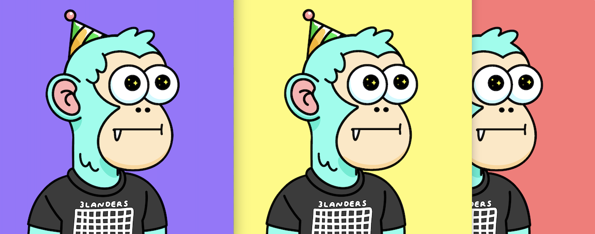

3lander NFT on Near blockchain
===================

This repository is meant to be applied for [ncd] certification. I used [nft-example] repository as a base for this project.

Smart contract that allows to mint 1 of 1 art NFT and gives the ability to the owner to determine the piece's color.
There are 3 variations of the work. The owner will determine which of the 3 is displayed.

The idea was inspired by [ngmi] NFT by XCOPY.
The image itself I got from one of the 3landers NFTs [3landers-5169]. Just because it looks funny



  [nft-example]: https://github.com/near-examples/NFT
  [ncd]: https://www.near.university/courses/near-certified-developerT
  [ngmi]: https://www.sothebys.com/en/buy/auction/2021/natively-digital-a-curated-nft-sale-2/ngmi
  [3landers-5169]: https://opensea.io/assets/ethereum/0xb4d06d46a8285f4ec79fd294f78a881799d8ced9/5169
Prerequisites
=============

  * Make sure Rust is installed per the prerequisites in [`near-sdk-rs`](https://github.com/near/near-sdk-rs).
  * Make sure [near-cli](https://github.com/near/near-cli) is installed.

Explore this contract
=====================

The source for this contract is in `contract/src/lib.rs`. It provides methods to mint and change color methods, as well as other NFT related methods from near-sdk.

Building this contract
======================
Run the following, and we'll build our rust project up via cargo. This will generate our WASM binaries into our `res/` directory. This is the smart contract we'll be deploying onto the NEAR blockchain later.
```bash
cd contract
./build.sh
```

Testing this contract
=====================
We have some tests that you can run. For example, the following will run tests to verify that our contract code is working.

*Unit Tests*
```bash
cargo test -- --nocapture
```

Using this contract
===================

// TODO make bash script that do all of that

### Quickest deploy

You can build and deploy this smart contract to a development account. [Dev Accounts](https://docs.near.org/docs/concepts/account#dev-accounts) are auto-generated accounts to assist in developing and testing smart contracts. Please see the [Standard deploy](#standard-deploy) section for creating a more personalized account to deploy to.

```bash
near dev-deploy --wasmFile res/lander_near_nft_ncd.wasm
```

Behind the scenes, this is creating an account and deploying a contract to it. On the console, notice a message like:

>Done deploying to dev-1234567890123

In this instance, the account is `dev-1234567890123`. A file has been created containing a key pair to
the account, located at `neardev/dev-account`. To make the next few steps easier, we're going to set an
environment variable containing this development account id and use that when copy/pasting commands.
Run this command to set the environment variable:

```bash
source neardev/dev-account.env
```

You can tell if the environment variable is set correctly if your command line prints the account name after this command:
```bash
echo $CONTRACT_NAME
```

The next command will initialize the contract using the `new` method:

```bash
near call $CONTRACT_NAME new_default_meta '{"owner_id": "'$CONTRACT_NAME'"}' --accountId $CONTRACT_NAME
```

To view the NFT metadata:

```bash
near view $CONTRACT_NAME nft_metadata
```

### Standard deploy

This smart contract will get deployed to your NEAR account. For this example, please create a new NEAR account. Because NEAR allows the ability to upgrade contracts on the same account, initialization functions must be cleared. If you'd like to run this example on a NEAR account that has had prior contracts deployed, please use the `near-cli` command `near delete`, and then recreate it in Wallet. To create (or recreate) an account, please follow the directions in [Test Wallet](https://wallet.testnet.near.org) or ([NEAR Wallet](https://wallet.near.org/) if we're using `mainnet`).

In the project root, log in to your newly created account with `near-cli` by following the instructions after this command.

    near login

To make this tutorial easier to copy/paste, we're going to set an environment variable for our account id. In the below command, replace `MY_ACCOUNT_NAME` with the account name we just logged in with, including the `.testnet` (or `.near` for `mainnet`):

    ID=MY_ACCOUNT_NAME

We can tell if the environment variable is set correctly if our command line prints the account name after this command:

    echo $ID

Now we can deploy the compiled contract in this example to your account:

    near deploy --wasmFile res/lander_near_nft_ncd.wasm --accountId $ID

NFT contract should be initialized before usage. More info about the metadata at [nomicon.io](https://nomicon.io/Standards/NonFungibleToken/Metadata.html). But for now, we'll initialize with the default metadata.

    near call $ID new_default_meta '{"owner_id": "'$ID'"}' --accountId $ID

We'll be able to view our metadata right after:

    near view $ID nft_metadata

Then, let's mint our first token. This will create a NFT based on Olympus Mons where only one copy exists:

    near call $ID nft_mint '{"token_id": "0", "receiver_id": "'$ID'", "token_metadata": { "title": "Lander", "description": "3landers", "media": "https://bafybeihgivtoptr34zxvnf6xvvkvontr23ohtkqk52nfazb2a7hj4wlqxq.ipfs.dweb.link/purple-3lander-nft.png", "media_hash": "N2Y4OWY0ZTdlMGQ4ZThmNTU5NWI0MTM0ZDNkNDc1MzMxMWM3NDhhZTJkZmU2NWJkM2I5YzRmMmFjNzEyYmM1Yw==", "copies": 1}}' --accountId $ID --deposit 0.1


Changing the color of the artwork
====================

Default color is purple. Available colors are purple, yellow and red. 

    near call $ID change_color '{"token_id": "0", "color": "Yellow"}' --accountId $ID
    near call $ID change_color '{"token_id": "0", "color": "Red"}' --accountId $ID
    near call $ID change_color '{"token_id": "0", "color": "Purple"}' --accountId $ID


Transferring our NFT
====================

Let's set up an account to transfer our freshly minted token to. This account will be a sub-account of the NEAR account we logged in with originally via `near login`.

    near create-account alice.$ID --masterAccount $ID --initialBalance 10

Checking Alice's account for tokens:

    near view $ID nft_tokens_for_owner '{"account_id": "'alice.$ID'"}'

Then we'll transfer over the NFT into Alice's account. Exactly 1 yoctoNEAR of deposit should be attached:

    near call $ID nft_transfer '{"token_id": "0", "receiver_id": "alice.'$ID'", "memo": "transfer ownership"}' --accountId $ID --depositYocto 1

Checking Alice's account again shows us that she has the Olympus Mons token.
